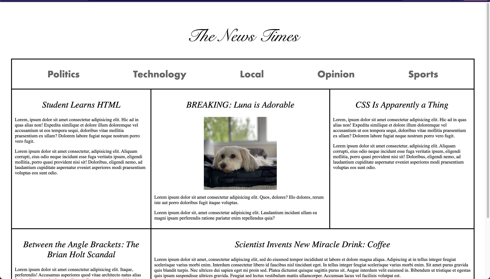
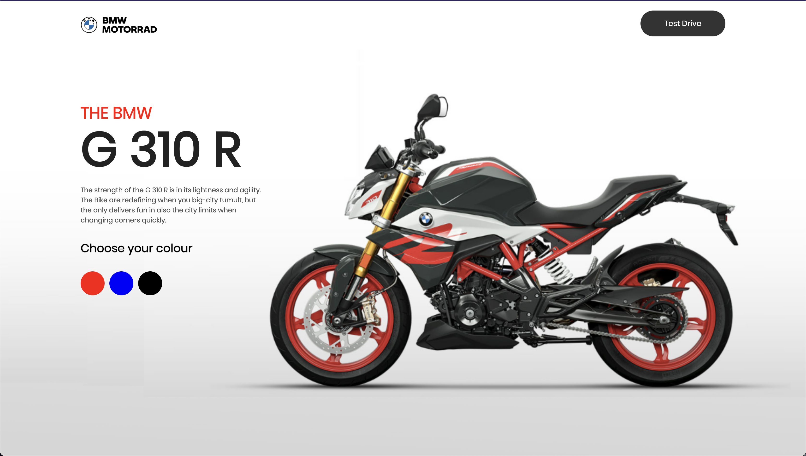
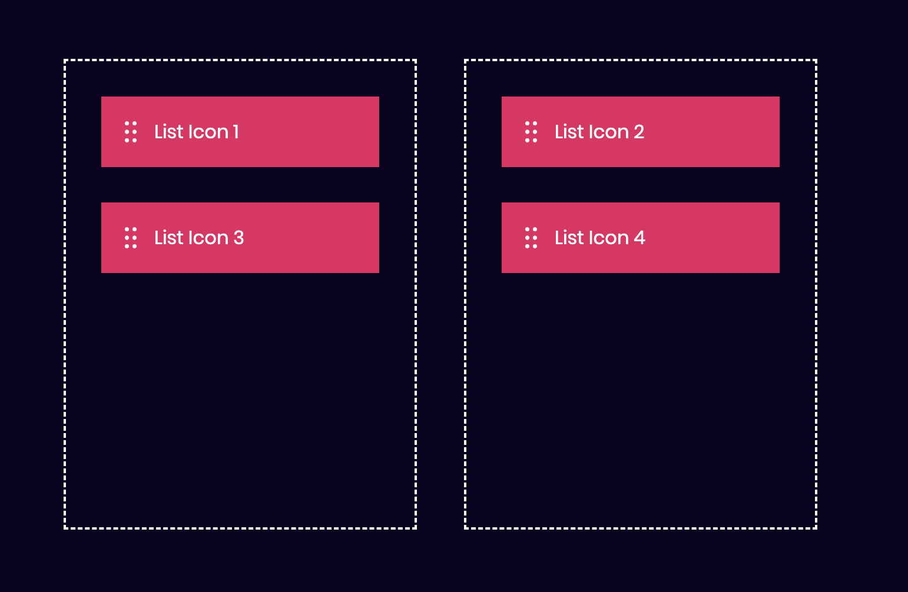

# Introduction to Web Development

Each directory represents a category of projects, and within each category, there are specific project folders listed. The README file serves as a guide for navigating the repository and understanding its contents.

# Directory Tree

- CSS

  - the_coffee_masters
    
  - the_news_times
    

- JS

  - calculator
    

- YT_PROJECTS

  - animated_logo
    

  - background_change_effect
    

  - bikes_website
    

  - digital_clock
    

  - drag_and_drop
    

  - drop_down_profile_menu
  - email_subscription_form
    

  - image_search_engine
  - image_slider
  - sidebar_menu
  - snackbar_notification
  - todo_list_app
  - twitter_login_page
  - video_in_background
  - weather_app
